# Azure Chaos Studio: Overview

Azure Chaos Studio is an Azure service that allows you to create & run chaos experiments on your application's infrastructure. By deliberately introducing faults that simulate real-world outages, you can test your application's resiliency and identify potential issues before they impact your customers.

## Key Takeaways

In this demo, you'll get an overview of Azure's Chaos Studio service; a managed service that can be used to simulate faults on your application's infrastructure.

- Running Chaos Experiments to introduce faults in Azure Key Vault (deny access) and seeing its impact on the application.
- Running Chaos Experiments via GitHub Workflows.

## Before You Begin

Please execute the steps outlined in the [deployment instructions](../../docs/deployment-instructions.md) to provision the infrastructure in your own Azure subscription.

## Walkthrough: Identify the Chaos Studio target (Key Vault)

1. In the Azure portal, you can navigate to the Azure Chaos Studio service from the search bar as follows.

   

2. Next, click on the `Target` tab and filter down to the `contoso-traders-rg{SUFFIX}` resource group.

   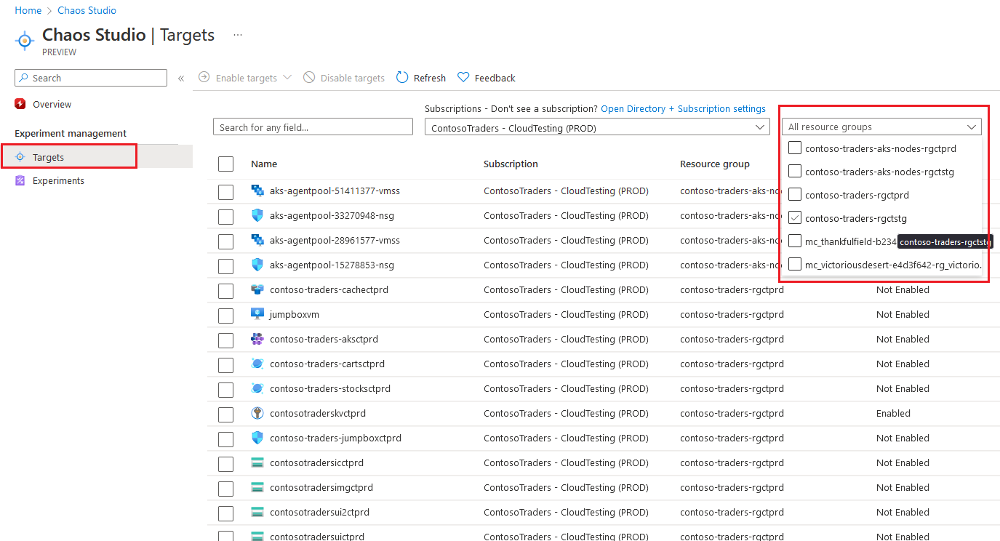

3. Next, go to the `contosotraderskv${SUFFIX}` key vault resource, and click on the `Manage actions` button.

   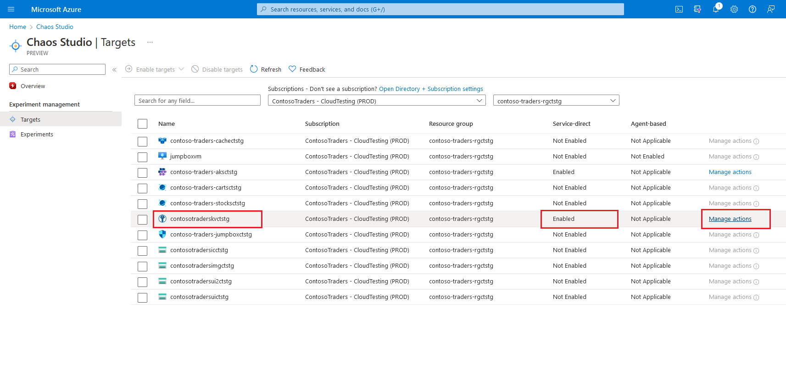

4. You'll notice that the "Key Vault Deny Access" fault will be being injected in the key vault when the chaos experiment is run. This fault will prevent the application from accessing the key vault, leading the application to fail.

   

## Walkthrough: Review the Chaos Experiment

1. In the Chaos Studio, click on the `Experiment` tab and click on the `contoso-traders-chaos-kv-experiment{SUFFIX}` experiment.

   

2. Click on the experiment's `Edit` button to review the experiment's configuration.

   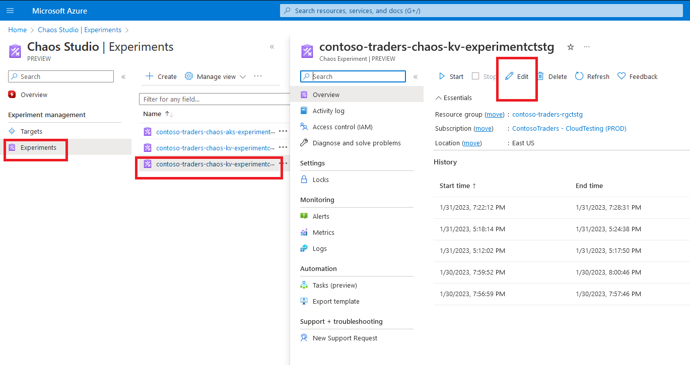

3. Click on the action's `Edit` button to review the action's configuration.

   

4. You'll notice that the experiment is configured to run on the the `contosotraderskv${SUFFIX}` key vault resource for 5 minutes. For the duration of the experiment, the `Key Vault Deny Access` fault will be injected into the key vault (i.e. the key vault will not be accessible even to principals mentioned in its access policies).

   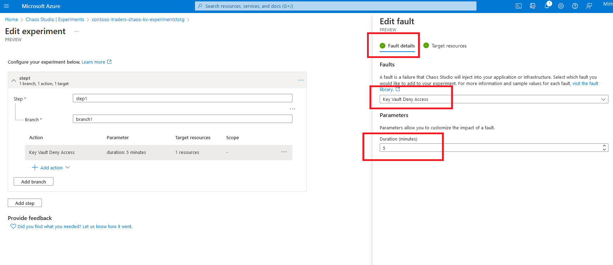

   

## Walkthrough: Run the Chaos Experiment

1. Before starting the experiment, you can verify that the application is working as expected by navigating to the application's URL and clicking on any product category (e.g. `laptops`). The application should load the product category page successfully by fetching data from the API.

   

2. Next, navigate to the Chaos Studio and click on the `Experiment` tab. Click on the `contoso-traders-chaos-kv-experiment{SUFFIX}` experiment and click on the `Start` button.

   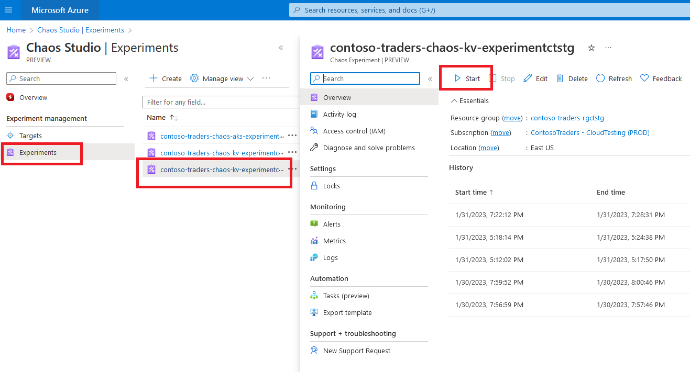

   

3. The experiment is now underway and during the course of the experiment, the key vault will not be accessible.

   

   

## Walkthrough: Exposing resiliency issues in application

1. The application's Products API follows the externalized configuration pattern, wherein upon startup, the API fetches DB connection strings, passwords etc from Azure key vault. The API then uses the connection string to connect to its product catalog db. If the key vault is not accessible, the API will fail to fetch the connection string and will fail to start.

   

2. Let us force the API to restart (note: upon restarting, it'll attempt to connect to the key vault to fetch the connection string). We can do by simply deleting the API's pod. The AKS deployment will then recreate the pod and the API will restart.

   

   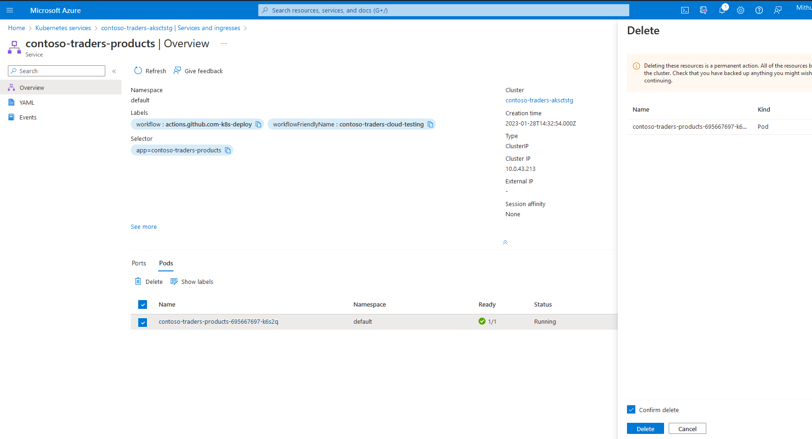

3. As soon as the new pod is created, the API will attempt to connect to the key vault to fetch the connection string. Since the key vault is not accessible, the API will fail to start.

   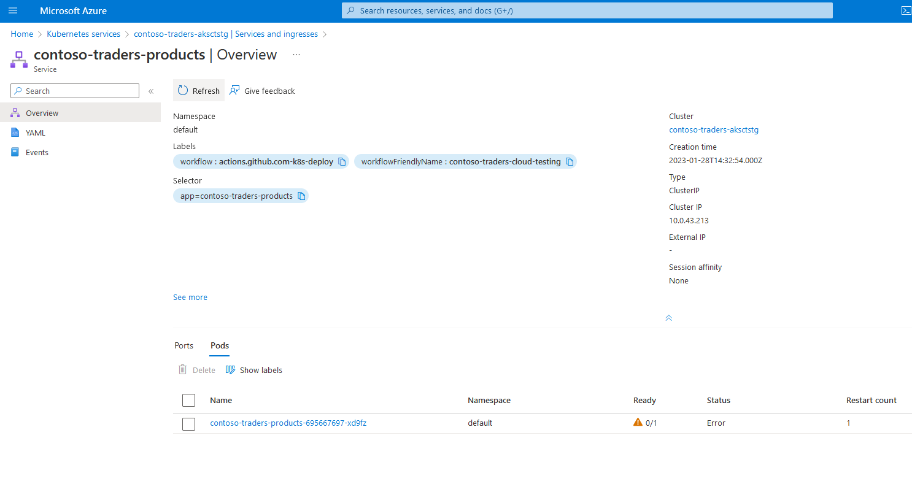

4. You can verify that the application is not working as expected by navigating to the application's URL and clicking on any product category (e.g. `laptops`). The application should fail to load the product category page.

   

## Walkthrough: After the Chaos Experiment ends

1. After the 5 minutes are up, the experiment will end and the key vault will be accessible again.

   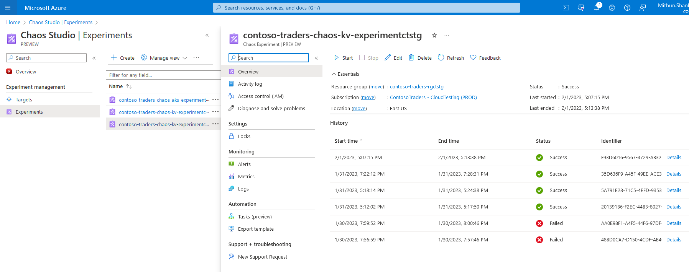

2. AKS's deployment ensures that the API will automatically restarted on crashes (with exponential back-off applied). Once the chaos experiment ends, the key vault will be accessible again. When AKS restarts the pod after this, the API will be able to connect to the key vault and will start successfully.

   

   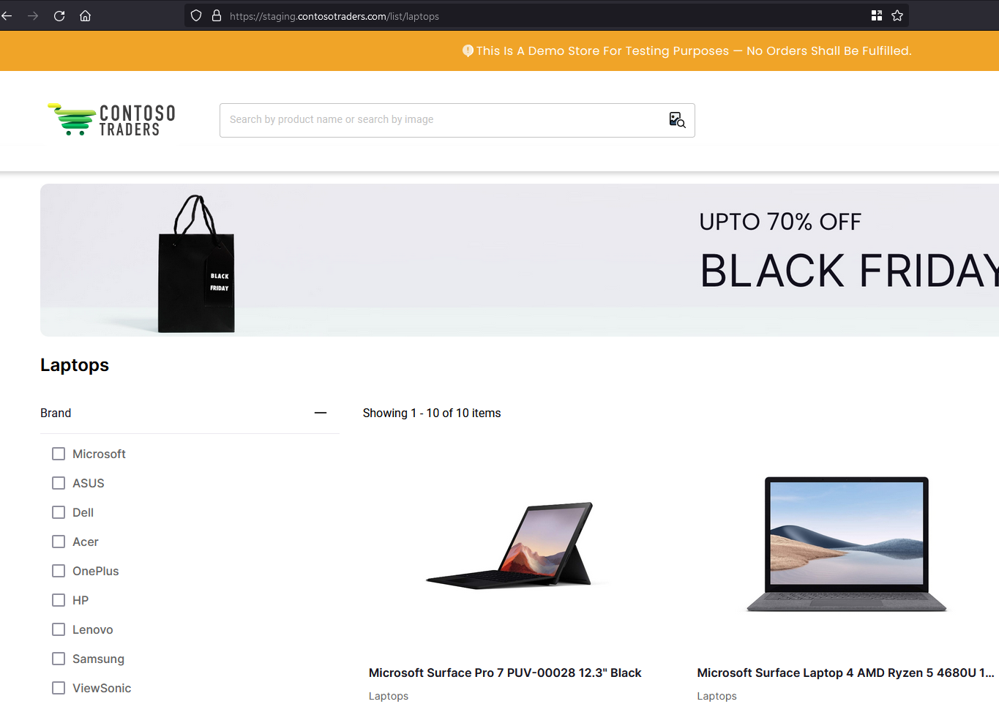

## Walkthrough: Running Chaos Experiments via GitHub Workflows

1. We have a Chaos Experiment `contoso-traders-chaos-aks-experiment{SUFFIX}` that injects faults (pod failures) into the AKS cluster: `contoso-traders-aks{SUFFIX}` for a duration of 5 mins.

   

2. Internally, this experiment leverages [Chaos Mesh](https://chaos-mesh.org/), a CNCF project that orchestrates fault injection on Kubernetes environments (e.g. network latency, pod failures, and even node failures).

   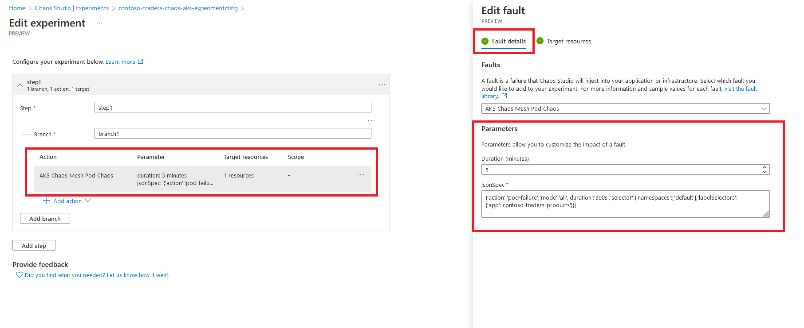

3. The github workflow `contoso-traders-cloud-testing.yml` trigger the AKS chaos experiment (pod failures), while simultaneously running a load test against the same AKS cluster.

   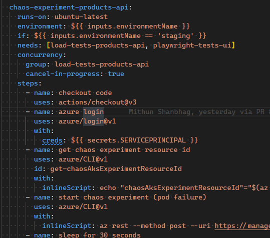

## More Information

- [Azure Chaos Studio](https://learn.microsoft.com/en-us/azure/chaos-studio/)
- [Pricing](https://azure.microsoft.com/en-us/pricing/details/chaos-studio/)
