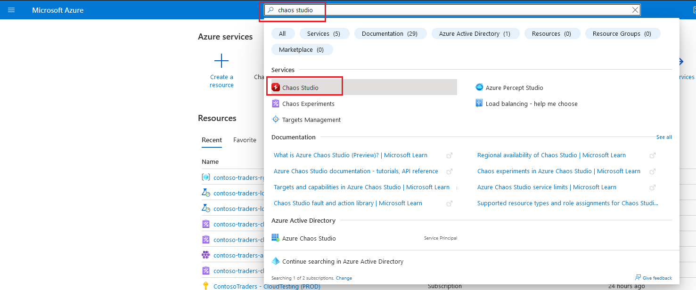
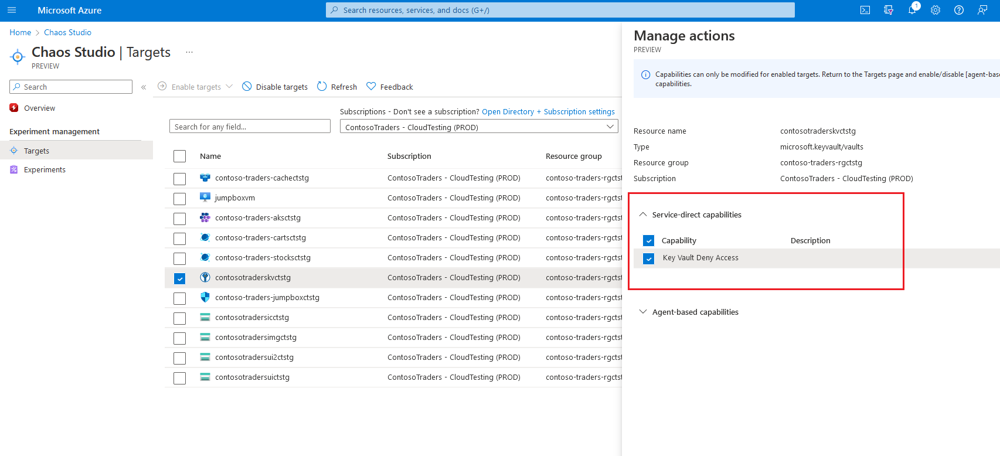

# Azure Chaos Studio: Overview

Azure Chaos Studio is an Azure service that allows you to create & run chaos experiments on your application's infrastructure. By deliberately introducing faults that simulate real-world outages, you can test your application's resiliency and identify potential issues before they impact your customers.

## Key Takeaways

In this demo, you'll get an overview of Azure's Chaos Studio service; a managed service that can be used to simulate faults on your application's infrastructure.

- TBD

## Before You Begin

Please execute the steps outlined in the [deployment instructions](../../docs/deployment-instructions.md) to provision the infrastructure in your own Azure subscription.

## Walkthrough: Identify the Chaos Studio target (Key Vault)

1. In the Azure portal, you can navigate to the Azure Chaos Studio service from the search bar as follows.

   

2. Next, click on the `Target` tab and filter down to the `contoso-traders-rg{SUFFIX}` resource group.

   

3. Next, go to the `contosotraderskv${SUFFIX}` key vault resource, and click on the `Manage actions` button.

   

4. You'll notice that the "Key Vault Deny Access" fault will be being injected in the key vault when the chaos experiment is run. This fault will prevent the application from accessing the key vault, leading the application to fail.

   

## Walkthrough: Running the Chaos Experiment

## Walkthrough: Exposing resiliency issues in application

## Summary

TBD

## More Information

- [Azure Chaos Studio](https://learn.microsoft.com/en-us/azure/chaos-studio/)
- [Pricing](https://azure.microsoft.com/en-us/pricing/details/chaos-studio/)
