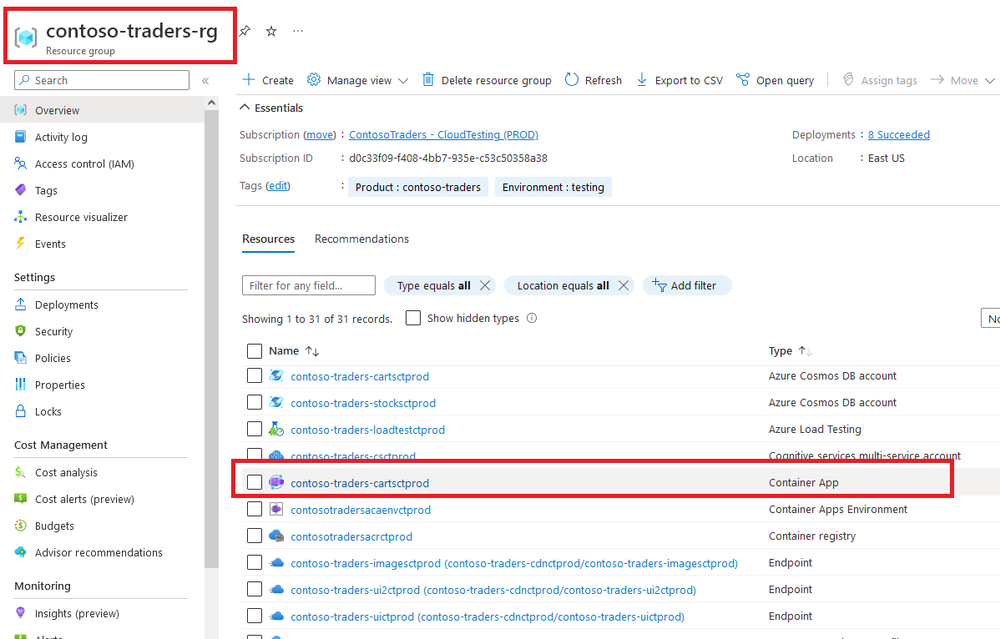
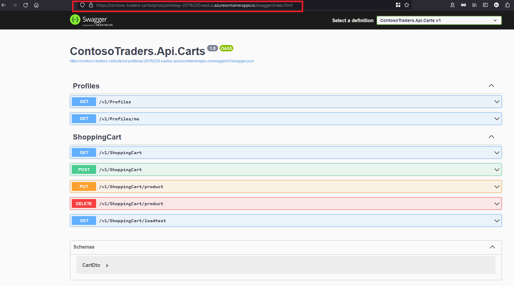

# Azure Load Testing: Azure Active Directory authentication

## Key Takeaways

In this demo, we'll will load test a website which requires Azure Active Directory authentication.

We'll demonstrate how you can fetch an AAD token in JMeter and use it to run load on your APIs on Azure Load Testing.

## Before You Begin

Please execute the steps outlined in the [deployment instructions](../../docs/deployment-instructions.md) to provision the infrastructure in your own Azure subscription.

## Setting up the AAD credentials

1. In the Azure portal, you can navigate to the Azure Load Testing resource in the `contoso-traders-rg{SUFFIX}` resource group.

1. Go to **Identity blade** and turn on System assigned Managed Identity. 

1. In the Azure portal, create an Azure Key Vault or use an existing one.

1. Add the following secrets to your Key Vault
    * `clientId`
    * `tenantId`
    * `username`
    * `password`

1. Go to **Access configuration** blade, select **Vault access policies** and create a new policy assigning `Get` permission on secrets to the Managed Identity of the Azure Load Testing resource.

## Identify the Load Test Target

1. In the Azure portal, you can navigate to the Azure Container App in the `contoso-traders-rg{SUFFIX}` resource group. This is the application that hosts the `Carts API`.

   

2. You can get the URL of the `Carts API` by as shown below.

   

3. In a separate browser tab, enter the following url in the address bar to load the API's swagger page: `<ACA url>/swagger/index.html`

   

4. You can now identify the API that you want to load test. In this case, we'll be load testing the `Carts API`'s `GET <ACA url>/v1/ShoppingCart/loadtest` endpoint. Please note down this endpoint for later use.

## Setting up the load test

1. Navigate to the Config.yaml(./loadtests/aad-load-testing/config.yaml).

1. In the secrets section, update the secret values with the Key Vault identifiers for each of the secret.

1. In the environment variables, update the value for the `cartsAPI`, `productsAPI` and `email` of the user used to login.

## Running the Load Test

You can manually run the Hub action from the Actions tab, click on:

Select workflow -> Contoso Traders AAD Load Test -> Run workflow.

## Summary

In this demo, we saw how Azure Load Testing can be used to generate load from within a virtual network to test private/restricted API endpoints.

## More Information

* [Troubleshooting private endpoints](https://docs.microsoft.com/azure/container-apps/troubleshoot-private-endpoints)
* [Test private endpoints by deploying Azure Load Testing in an Azure virtual network](https://learn.microsoft.com/azure/load-testing/how-to-test-private-endpoint)
* [Scenarios for deploying Azure Load Testing in a virtual network](https://learn.microsoft.com/azure/load-testing/concept-azure-load-testing-vnet-injection)
* [Blog Post: Load test endpoints with access restrictions using Azure Load Testing](https://techcommunity.microsoft.com/t5/apps-on-azure-blog/load-test-endpoints-with-access-restrictions-using-azure-load/ba-p/3610412)
* [Blog Post: Load test private endpoints deployed in another Azure region or subscription](https://techcommunity.microsoft.com/t5/apps-on-azure-blog/load-test-private-endpoints-deployed-in-another-azure-region-or/ba-p/3693277)
