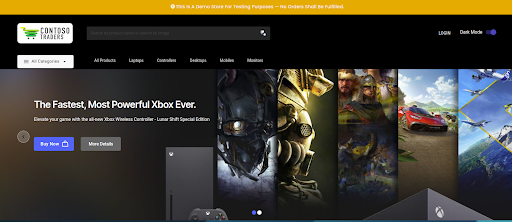

# Setup Repo Locally using VS Code
- git clone https://github.com/microsoft/ContosoTraders.git

- Go to ContosoTraders/src/ContosoTraders.Ui.Website/

- Do **npm init playwright@latest**
   Run the install command and select the following to get started:
   - Choose between TypeScript or JavaScript (default is TypeScript)
   - Name of your Tests folder (default is tests or e2e if you already have a tests folder in your project)
   - Add a GitHub Actions workflow to easily run tests on CI

- Playwright will download the browsers needed as well as create the following files.

The playwright.config is where you can add configuration for Playwright including modifying which browsers you would like to run Playwright on. If you are running tests inside an already existing project then dependencies will be added directly to your package.json.
The tests folder contains a basic example test to help you get started with testing. For a more detailed example check out the tests-examples folder which contains tests written to test a todo app.

- Do **npx playwright test** to run the test manually

- Do **npx playwright show-report** to view browser wise report of the test

- Install the VS Code extension from the marketplace or from the extensions tab in VS Code.

- You can run a single test by clicking the green triangle next to your test block to run your test. Playwright will run through each line of the test and when it finishes you will see a green tick next to your test block as well as the time it took to run the test.

View all tests in the testing sidebar and extend the tests by clicking on each test. Tests that have not been run will not have the green check next to them. Run all tests by clicking on the white triangle as you hover over the tests in the testing sidebar.

# Test Case Review

Inside the test folder there is test,spec.js which is the file we use for writing our test cases.

Here is a test case for a search bar for searching using text. 

In this test case we are clicking the search bar and filling the input with keywords, here we provided “laptops” for an example. Pressing enter must redirect it to the desired URL.

In case of any difference occurring while running the test will result in error as mentioned below. Here the redirect URL is unmatched. The application redirection URL and test case URL were different.

## Run Test Case

By Running npx playwright test we can run the test manually and view the passed and failed test cases.

PASSED

FAILED

By Running npx playwright show-report we can view the entire list of test cases run for browsers and time taken to run the test cases in each browser.

PASSED

FAILED

## Cross-browser testing

The test failed in Microsoft Edge browser and passed for all other browsers.

# Testing Scenarios

**Search by text**

Click the search bar on the header

Enter the keyword for the product to be searched (for eg: laptops)

Press ENTER/Search Icon/Tab

This will result in the listing of products as per the searched keyword.
Any issue with the API or redirected url will trigger an error message while testing.

**Enable Dark Mode**

Select the toggle button for Dark mode on the right side of header. Checking it will turn the application to dark mode.

DARK MODE OFF

DARK MODE ON

# Complex Testing Scenarios

Login using Microsoft Account Azzure ID.

Click LOGIN button in header

Popup will be generated to enter the login credentials

Choose Authenticator App for identification

Selecting the Authentication App will wait for trigger a approval request from the mobile device. 

Approving the request from mobile app will successfully login to the application

Too much waiting time for approving the request will result in expiry

